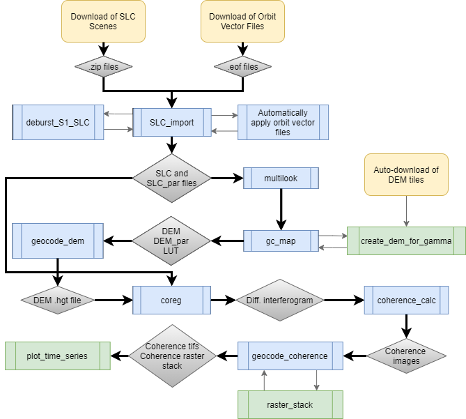
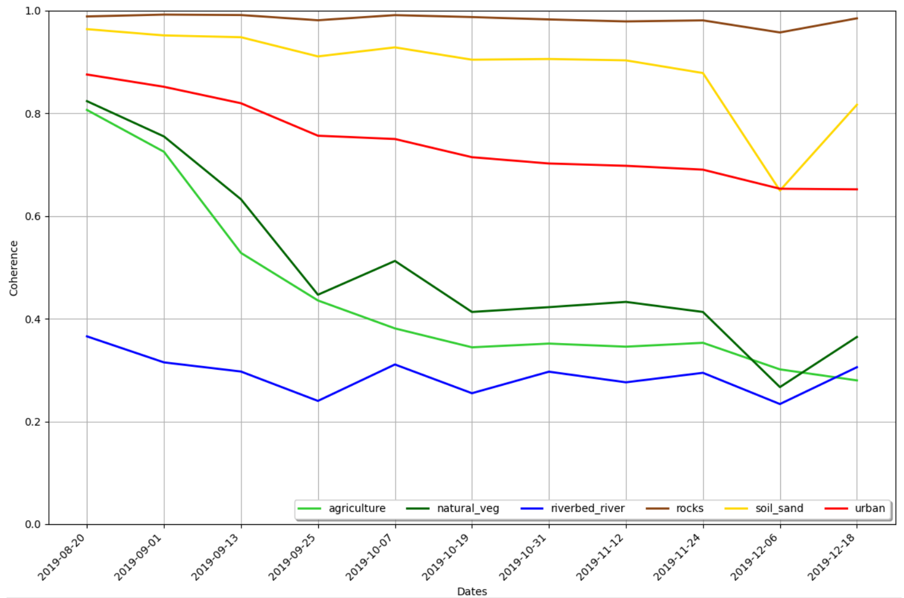

# InSel
### Interferometric processing with Sentinel-1

This tool allows for an automatic download of Copernicus Sentinel-1 scenes and aims to simplify the processing of SLC 
scenes using the [_GAMMA remote sensing software_](https://www.gamma-rs.ch/software).

This package is a project by Marlin M. Mueller and Jonas Ziemer for the module GEO410 of the M.Sc. Geoinformatics at the
Friedrich-Schiller-University Jena.

Basic functionality includes:
* Automatic download of all Copernicus Sentinel scenes using extent by user-specified shapefile
    * mainly developed and tested for Sentinel-1
* user-friendly processing steps for the processing of Sentinel-1 SLC scenes using the _GAMMA remote sensing_ software
    * import and deburst
    * precise orbit definition using orbit files (external files can be found [here](https://qc.sentinel1.eo.esa.int/))
    * multilooking
    * creation of the geocoding lookup table based on auto-created DEM using [pyroSARs](https://github.com/johntruckenbrodt/pyroSAR) 
      autocreate function found [here](https://pyrosar.readthedocs.io/en/latest/pyroSAR.html#module-pyroSAR.gamma.dem)
    * coregistration of multiple files
    * calculation of coherence pairs
    * plotting of coherence time series data
    
Notice, you need a full version of the _GAMMA remote sensing_ software and a high-performance computer.

Developed and tested using Python 3.6 using CentOS 7 (Linux 3.10)

### Workflow of the InSel module:

_InSel workflow_

### Example Coherence Time Series Animation (South Africa):

_Sentinel-1 coherence time series from 2019-08-20 to 2019-12-18 close to Augrabies National Park, South Africa_

### Time Series Plot for different land cover classes:

_Sentinel-1 coherence time series from 2019-08-20 to 2019-12-18 for 6 different land cover classes_
